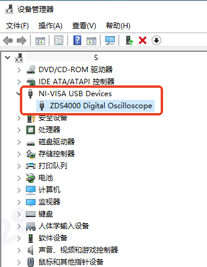

示波器截图助手

# 概述

程序运行在 PC 上，通过 USB 线缆连接 PC 与 示波器后，可以控制示波器截图，并拉取回 PC。

# 使用简介

程序界面：

## 操作步骤

1. 连接设备：菜单栏【文件】→【连接】
2. 搜索设备：在弹出的界面中，点击【搜索】，等待搜索结束。

3. 在【设备列表】中，鼠标双击需要连接的设备所在行，就可以连接到指定设备。连接成功后，右下角有已连接到具体设备型号的提示信息。

4. 截图：设备连接后，点击【截图】就可以截图并拉取图像至 PC。主界面上部显示截图，下部显示全部截图的缩略图。

5. 查看之前的截图：双击缩略图列表的任一图像，该图像会被加载到上部。支持通过滚轮缩放，点击拖动等功能。

# 安装

程序自身不需要安装，解压缩后直接使用。因为涉及 USB 通信，需要安装一些依赖。

## 安装驱动

### 广州致远 ZLG 示波器

如果是广州致远 ZDS 系列示波器，可使用程序压缩包里的 **drv\\zds_visa** 目录内提供的驱动程序。操作步骤：

1. 示波器打开电源，并用 USB 线缆连接到 PC 。

3. 打开设备管理器，大概能看到一个带有黄色三角形符号的驱动的设备：

4. 在这个设备上鼠标右键点击，在弹出的窗口选择【更新驱动程序】：

5. 在“更新驱动程序”界面，点击【浏览】按钮，drv\\zds_visa 文件夹，点击【下一步】：

6. 等待驱动程序安装完成，然后点击【关闭】“更新驱动程序”界面关闭：

7. 在“更新驱动程序”界面关闭后，回到设备管理器，会看到如下图的新设备，表明驱动程序安装完成：

**【特别说明】**：如果之前尝试安装过周立功 ZDS 系列示波器驱动程序，你就不会在第3步看到带黄色三角形符号的驱动的设备，而是类似下图这样的话，请按后续的步骤卸载当前不匹配的驱动。

**卸载不匹配的驱动步骤**：

1. 在上图设备上点击鼠标右键，在弹出的菜单选择【卸载设备】：

2. 在弹出的“卸载设备”窗口中，勾选【删除此设备的驱动程序软件】，点击【卸载】，等待操作完成。

3. 驱动卸载完成后，“卸载设备”窗口消失，回到设备管理器，点击菜单栏【操作】→【扫描检测硬件改动】，应该就能看到“带有黄色三角形符号的驱动的设备”说明旧驱动卸载成功，请接着安装步骤4继续执行。如果在【扫描检测硬件改动】后，仍然还能看到“ZDS1000 Digital Oscilloscope” 的设备，请再次重复卸载步骤直到看到“带有黄色三角形符号的驱动的设备”。

### 其他型号的示波器

对于其他型号的示波器需要 VISA 的支持。

#### NI-VISA 库

经过测试 NI 提供的 VISA 库兼容性最好，推荐使用。

先从 NI 官网下载 VISA。打开这个网址 https://www.ni.com/zh-cn/support/downloads/drivers/download.ni-visa.html ，选择“受支持的操作系统”和“版本”之后就可以点击下载。如果网络受限，可以点击“离线安装”下载 iso 文件使用。以下的说明内容是使用离线的 iso 文件，在线安装亦可参考。

如果 PC 的操作系统是 win10 以上的，双击 iso 文件就可以“挂载”这个文件，并会在“我的电脑”出现一个光驱的驱动器，打开这个驱动器。如果双击 iso 文件是打开了压缩软件的界面，也可以先解压缩到一个文件夹里。

打开 install.exe 文件，参考下面图片中标注的点安装。安装完成后**需要重启系统**。

#### Rohde & Schwarz VISA 库

R&S 提供的 VISA 库在兼容性方面虽不及 NI-VISA，但是其安装包小，2025年3月更新后，功能也满足要求。
请自行前往 https://www.rohde-schwarz.com/us/driver-pages/remote-control/3-visa-and-tools_231388.html **R&S®VISA Installers** 下载安装包。

#### 注意
如果安装了多个厂家的 VISA 库，一般最后安装的 VISA 库会被优先使用。R&S VISA 库提供了一个可视化配置工具，可以选择使用哪个 VISA 库。可以阅读相关文档了解更多信息~

-----