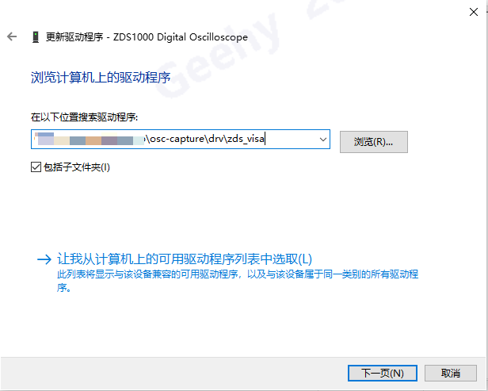

示波器截图助手

# 概述
这个软件运行在 PC 上，通过 USB 线缆连接 PC 与 示波器后，可以操作示波器截图，并拉取回 PC。

# 使用简介
程序界面请参考：

## 操作步骤

1. 连接设备：菜单栏【文件】→【连接】
2. 搜索设备：在弹出的界面中，点击【搜索】，等待搜索结束。

3. 在【设备列表】中，鼠标双击需要连接的设备所在行，就可以连接到指定设备。连接成功后，右下角有已连接到具体设备型号的提示信息。

4. 截图：设备连接后，点击【截图】就可以截图并拉取图像至 PC。主界面上部显示截图，下部显示全部截图的缩略图。

5. 查看之前的截图：双击缩略图列表的任一图像，该图像会被加载到上部。支持通过滚轮缩放，点击拖动等功能。

# 安装

1. 如果之前没有使用过任何其类似软件，请参考 **通用安装说明.pdf** 先安装 Python 解释器。
2. 按本文后续说明安装必备组件。
3. 按《通用安装说明》 2.3 节及后续说明操作

## 安装必备组件
组件被打包为 osc_capture_comp.zip。除非特别说明，否则组件包只需要在第一次使用前进行安装。获取并解压文件到合适的位置。

## Package
双击解压后的 install_packages.bat 文件，等待安装完成。

## VISA 程序包
采用 Rohde & Schwarz 公司的 VISA 驱动包。安装程序名称：RS_VISA_Setup_Win_7_2_2.exe，双击可执行文件进行安装，安装过程全部采用默认设置即可。安装完成后需要**重启 PC**，或者在整个安装完成后重启亦可。

## 周立功 ZDS 示波器驱动
周立功 ZDS 系列示波器驱动程序不是标准的 VISA 驱动，需要单独安装。请严格按以下步骤安装：

1. 解压缩 osc_capture_comp.zip 文件，在解压缩后找到 ZDS_USB_DRV 文件夹。

2. 示波器打开电源，并用 USB 线缆连接到 PC

3. 打开设备管理器，大概能看到一个带有黄色三角形符号的驱动的设备：

4. 在这个设备上鼠标右键点击，在弹出的窗口选择【更新驱动程序】：

5. 在“更新驱动程序”界面，点击【浏览】按钮，选择第一步解压得到的文件夹。我的 PC 上，这个地址是 D:\zds_osc_usb_driver 请确保实际 PC 上的路径。选择好路径后，点击【下一步】：

6. 等待驱动程序安装完成，然后点击【关闭】“更新驱动程序”界面关闭：

7. 在“更新驱动程序”界面关闭后，回到设备管理器，会看到如下图的新设备，表明驱动程序安装完成：

**【特别说明】**：如果之前尝试安装过周立功 ZDS 系列示波器驱动程序，你就不会在第3步看到带黄色三角形符号的驱动的设备，而是类似下图这样的话，请按后续的步骤卸载当前不匹配的驱动。

**卸载不匹配的驱动步骤**：

1. 在上图设备上点击鼠标右键，在弹出的菜单选择【卸载设备】：

2. 在弹出的“卸载设备”窗口中，勾选【删除此设备的驱动程序软件】，点击【卸载】，等待操作完成。

3. 驱动卸载完成后，“卸载设备”窗口消失，回到设备管理器，点击菜单栏【操作】→【扫描检测硬件改动】，应该就能看到“带有黄色三角形符号的驱动的设备”说明旧驱动卸载成功，请接着安装步骤4继续执行。如果在【扫描检测硬件改动】后，仍然还能看到“ZDS1000 Digital Oscilloscope” 的设备，请再次重复卸载步骤直到看到“带有黄色三角形符号的驱动的设备”。

-----

至此，必备的组件安装完成，请重启 PC 后，按《通用安装说明》 2.3 节及后续说明操作。

-----
